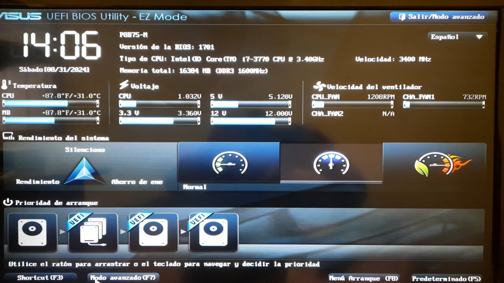
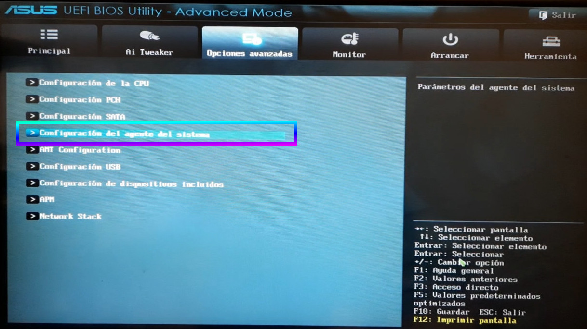
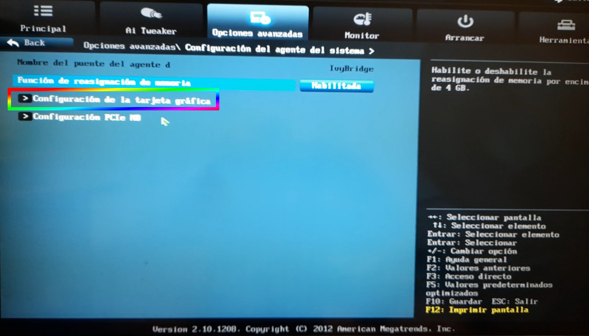
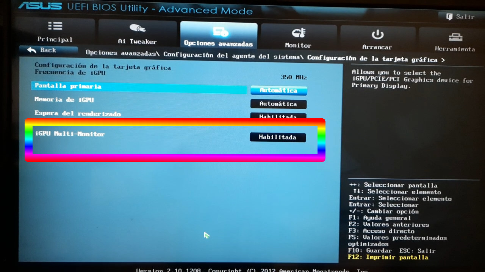

 

# Vga-nativa-desactivada-por-Tarjeta-grafica-Nvidia

Se suele desactivar la salida VGA por diferentes motivos, teniendo instalada una tarjeta Nvidia. Solución.

---

Un día de tormenta desactivas la electricidad del equipo, y cuando conectas todo, la salida Nvidia funciona perfectamente, pero el monitor VGA a través de la salida nativa de la placa madre, no muestra signos de vida.

> Aparece un mensaje que debes presionar F1, o en algunos casos F2 o Del e ingresar a la Bios.

Y es así el problema está ahí, en la Bios.

---

> En nuestro caso el equipo es un Procesador Inter Core i7 -3770 viejito, CPU @3,40 GHz x 4, memoria de 16 GiB y una tarjeta gráfica NVIDIA GP107 GeForce GTX 1050 Ti.

---

# 2. La solución para rescatar la salida VGA para usar multiples monitores, está en la Bios.

### 2.0.1. Hay que habilitar la opción iGPU Multi-Monitor, que se halla en nuestro caso en esta dirección:

> Opciones avanzadas/Configuración del agente del sistema / Configuración de la tarjeta gráfica / iGPU Multi-monitor => activar a [HABILITADA].

---

## 2.1. Imagenes capturadas sobre las instancias de nuestra Bios y como llegar:

---

---

- Ver info de Elinv en Google Search:

<a href="https://www.google.com.ar/search?q=elinv">
   Enlace a la info de Elinv  -> en Google Search
</a>

- Ver canciones de Elinv:

<a href="https://www.reverbnation.com/elinv">
   Enlace a las canciones de Elinv  -> en Reverbnation
</a>

👍 Gracias!

🛠️ Errores, sugerencias, ideas, envialas a nuestro mail: <elinv.elinv@gmail.com>

# E L I N V

